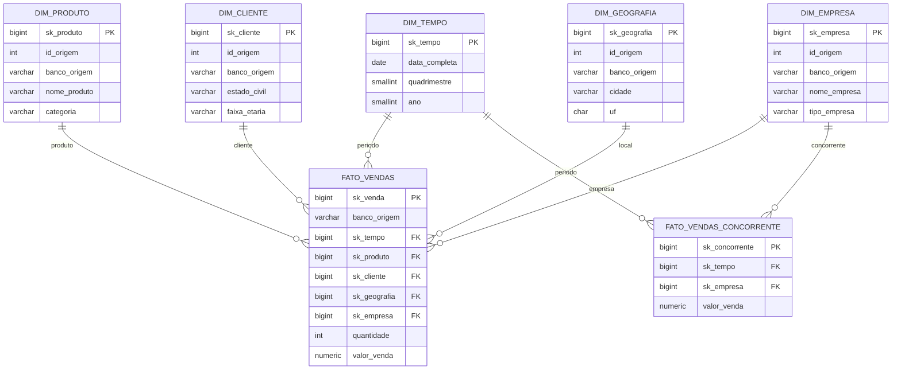

# Modelo dimensional final

## Grão

Uma linha de `fato_vendas` representa **um item de produto de uma venda**. A concorrente possui
grão mensal porque sua planilha não oferece transações individuais.

## Rastreabilidade da origem

`dim_produto`, `dim_cliente`, `dim_geografia` e `dim_empresa` possuem `id_origem` e
`banco_origem`. `fato_vendas` também registra `banco_origem`. `dim_tempo` é uma dimensão
conformada e compartilhada: datas não pertencem a um banco específico. Na concorrente, a origem
`PLANILHA` fica em `dim_empresa`; na empresa própria, a origem é `ORACLE` (a base Oracle foi
simulada no PostgreSQL `petshop_oracle`).

